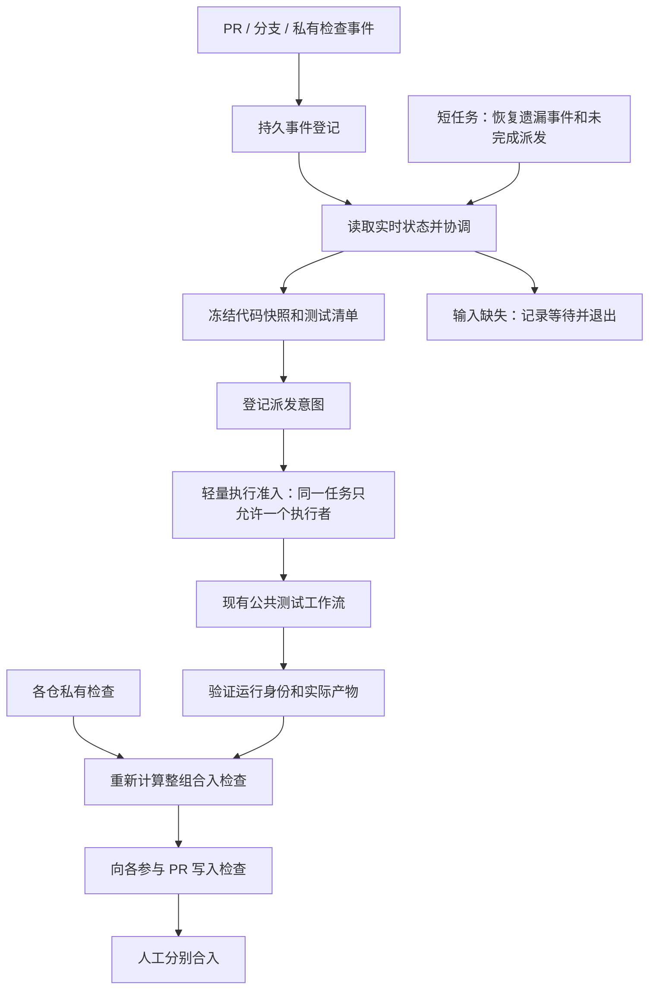

<!-- Author: zhekui. Proposed specification; implementation limits in README.md. -->
# 联合 CI 设计草案 v1

日期：2026-09-23。状态：可评审设计，已纳入“用户无感切换”要求；未实现、未运行验收。

用户已确定：整组检查通过后分别人工合入；本方案不增加自动合入权限。

## 1. 目标与范围

同一份代码组合、同一测试输入的公共测试避免重复执行；各仓专属测试保持独立。优先复用现有路由器、测试脚本、runner 和结果汇总。普通 PR 行为保持原样。

**产品约束：用户仍按原方式写依赖分支、创建/更新 PR、查看检查、点击原重跑入口、人工合入。后台改变调度，不给用户增加一套联合 CI 操作流程。**

### 用户操作契约（优先于历史实验提示词）

| 用户原来的动作 | 切换后的动作 | 后台变化 |
|---|---|---|
| 按现有 PR 模板填写依赖分支 | 原样 | 解析依赖并生成内部关联关系 |
| 创建 PR、push、修改依赖正文 | 原样 | 自动生成新快照、关联及失效旧结果 |
| 看本 PR 的 Checks / aggregate | 原入口 | 展示本仓检查和共享测试结果及日志链接 |
| 点击现有 Re-run jobs / Re-run failed jobs | 原入口 | 适配器协调新尝试；不要求评论命令 |
| 取消本 PR 的运行 | 原入口 | 撤销该 PR 的订阅；不能误杀其他 PR 仍需要的任务 |
| 检查通过后人工合入 | 原样 | 关联组门禁已在后台汇总 |

用户不必新增 `CI_MODE=joint`、`JOINT_ID`、标签、关联评论或 Draft→Ready 操作；不要求修改分支命名、同时提 PR。管理员的灰度开关、内部 group_id 和诊断工具不出现在普通用户必经路径。

“无感”主要指操作与入口不变，**不等于隐藏关联组门禁的语义变化**：已可靠识别为联合改动的 PR 会等待整组必要检查，页面用一句话说明正在等待哪个检查。普通依赖不能被无依据升级成必须一起合入。

验收前要用真实历史 PR 正文和操作记录建立旧行为基线；不能用重新设计的新模板替代兼容性。

生产机制支持两个或更多变更仓库；四仓实验必须覆盖 Arsenal、Driver、Synapse、Sim，但**不要求每次生产联合提交都创建四个 PR**。未改动仓库作为固定 SHA 的依赖；只有参与变更的 PR 承担相应私有门禁。实验的四条公共 lane 是覆盖指标，不能替代真实测试清单。

| 层次 | 成功定义 | 不代表什么 |
|---|---|---|
| 调度实验 | 去重、取消、恢复、汇总满足状态契约 | 真实硬件功能正确 |
| GitHub 实验 | 真实事件、dispatch、可信检查、保护规则生效 | Pod 清理及生产资源可用 |
| 运行环境实验 | 真实 runner/Pod 启停、取消、清理闭环 | 所有生产测试均已通过 |
| 生产接入 | 指定范围路由与真实测试均验收，回滚有效 | 跨仓原子合入 |

本机证据：已只读检查 Arsenal `ci_router.yml`、`ci_router_external_repo.yml`、`arsenal_CI/determine_workflows.sh` 和 Synapse `ci_router.yml`。本地 Arsenal HEAD 为 `2c6554ff1e883757aa5a5c2fbce5758dd8f1f41d`，未确认等于远端当前主线。Synapse 存在 `@main` reusable workflow 调用和 `github.head_ref` 注入；联合运行必须解决执行版本漂移。当前未定位到最新 Grok 实验源码或完整证据包，历史报告不作为本轮验证结果。

## 2. 总体流程



等待依赖期间没有测试 Pod、没有长驻等待 job。协调任务写完状态立即退出。补偿扫描是有界短任务，只处理未收敛组；间隔和容量上限在实验测量后设定，不配置常驻轮询进程。

## 3. 关联与输入契约

对外只接受并复用现有依赖字段及其解析、默认值、优先级。历史实验中的 `JOINT_ID` / `JOINT_CI_GROUP` 可留作测试适配层输入，不能成为生产用户必填项。后台生成稳定内部 group_id；成员变化单独增加 membership_revision。

### 自动关联规则

1. 用现有 parser 解析 PR 实际依赖版本；默认主线、固定 tag/SHA 是依赖，不因为恰好有 PR 指向它就自动拉人入组。
2. 显式非默认依赖分支映射到确定仓库、head 仓库和分支，查询唯一开放 PR；不能仅用分支字符串跨 fork 匹配。
3. 所有成员对同一仓库的有效版本要求一致，且测试输入组合兼容时才允许自动共享。单向引用可用于发现候选，不要求用户双向填写；但不能据此强行改写被引用 PR 的测试输入或合入语义。
4. 第一版仅对后台兼容性规则能证明成立的组合启用整组共享；对单向引用导致默认依赖不同、同仓多 PR、冲突和多义关系保留原 CI，不要求用户学习新字段解决调度器局限。
5. 分支存在但暂无 PR：立即按原语义固定 SHA 验证，不等未来 PR；稍后 PR 出现时，只在输入与证据完全相同时复用，否则新组合重测。
6. 显式分支不存在或用户填写有误：沿用原有错误语义，不能为“无感”偷偷替换默认分支。仅调度关联不确定时退回旧路径。
7. 维护分支→消费者与 PR→组的反向索引；后到事件自动重新发现。补偿协调覆盖遗漏事件，不要求用户再次提交。

先覆盖可证明等价的场景，不能为了所有跨仓场景都去重而改变既有测试组合。后台灰度配置决定覆盖范围，用户无需 opt-in。

| 对象 | 最少字段 | 校验 |
|---|---|---|
| Group | group_id、membership_revision、参与 PR 集合、固定依赖 | 仓库允许列表；同仓多 PR 第一版拒绝；同一 PR 不同时参加两个活跃组 |
| Snapshot | 每仓 head/base/candidate SHA、测试清单摘要、工具与镜像版本 | SHA 格式合法且真实可获取；候选代码可重建；引用不可漂移 |
| Task | task_key、suite、参数、资源类型、产物依赖、结果消费者 | 由各仓路由需求展开；不能只按 workflow 文件名去重 |
| Attempt | group generation、snapshot_id、attempt、dispatch_id、执行者身份 | 新重试有新 attempt；旧执行者失去写入资格 |
| Result | workflow/run/run_attempt/job、task_key、snapshot、产物 digest | 可信来源；完整必需任务集合；实际执行代码与快照一致 |

一次测试快照的成员必须明确，不能通过短暂等待猜测还有谁会加入。生产自动发现中尚无 PR 的已存在分支作为固定依赖，不自动产生“缺失 PR”合入阻塞；实验显式声明四个必需参与 PR 时，缺失 PR 才是该场景的 blocker。新成员产生新 membership_revision，不能偷偷修改正在运行的快照。

### 两类身份分开

```text
snapshot_id = hash(规范化后的全部语义输入)
task_key    = hash(snapshot_id, suite, 完整参数, 环境, 构建依赖)
attempt_id  = (group_id, generation, task_key, attempt)
```

规范化包括字段排序、集合排序、显式默认值、类型与 schema_version；不含时间戳等非语义字段。第一版仅在同组内复用结果，跨组共享缓存后置，避免扩展撤销和归属问题。

输入至少包含：所有依赖提交、目标基线、实际测试 tree/candidate、Arsenal 测试实现、路由版本、工具链、镜像 digest、卡数、硬件/内核类别、环境参数、测试数据版本。镜像 tag 和分支名只是展示字段。

私有检查若实际读取跨仓依赖，也必须绑定对应快照；不能仅凭本仓 head 未变而复用。

## 4. 两个独立判断

```text
ready_to_test = 成员声明一致 AND 输入完整且可获取
                AND 可构造不可变候选快照 AND 当前组未取消/失效

group_checks_passed = 必需公共任务逐项通过
                      AND 参与 PR 私有必需检查通过
                      AND 所有证据身份匹配当前快照与尝试

merge_ready = group_checks_passed AND 参与 PR 开放且非 Draft
              AND live head/base/依赖与快照一致
              AND 审批等现有仓库合入规则满足
```

`ready_to_test` 不等待 Draft 解除或私有 CI。`public_success` 不等于 `merge_ready`。缺少必需检查视为未完成；未知、skipped、neutral 不自动视为执行成功。合法“不适用”须由路由清单证明，并保留原因。

若只测试 PR head 组合，只能称为兼容性验证。作为合入依据的结果须绑定目标基线和实际候选 tree；目标分支变化后保守失效重测。特殊的 tree 等价复用留待后续证明。

## 5. 状态与取消

| 事件 | 事务内状态变化 | 外部动作 |
|---|---|---|
| 成员/代码/基线变化 | generation 增加；旧快照失效；登记所有 PR 检查失效意图 | 写 pending；撤销旧执行；生成新快照 |
| 输入齐备 | 建立唯一任务与派发意图 | 派发轻量入口 |
| 执行者准入 | 原子认领任务，记录 owner/fence | 准入后才能分配昂贵资源 |
| 测试回报 | 比对 generation/attempt/snapshot/owner；记录有效结果 | 必要时重新汇总 |
| 私有检查完成 | 更新证据并重新计算 | 不重跑公共测试，只更新合入检查 |
| 取消 | 先持久化取消标记并撤销写入资格 | 请求取消、终止子进程/Pod、确认清理 |
| 显式 retry | 新 attempt；旧结果保留 | 默认重跑整套公共测试 |
| 一笔 PR 合入 | 进入 partial_merge，保存实际合入提交与方式 | 重新核对其余 PR 基线/候选；有变化就重测 |

取消区分 `cancel_requested` 与 `cancelled_clean`：前者已禁止成功回写，后者还要求资源消失。普通重复事件不得清除取消标记；显式 retry 或明确的新版本策略才能创建新尝试。

同一快照被用户取消后，普通重复事件不能恢复；用户点击原有重跑按钮才创建新 attempt。新 commit 是否重新触发沿用该仓原 CI 行为，属于新 generation，不能被算成旧尝试复活。管理员显式暂停整组是另一个内部操作，不替代普通用户的 Cancel。

单 PR 取消只撤销该消费者的当前尝试。仍有其他有效消费者时共享任务继续，但被取消 PR 不因其他消费者成功而变绿；所有消费者都不再需要时才取消共享资源。若整组合入依赖该 PR，则整组门禁不通过；其他仓私有检查仍独立。

## 6. 去重不能只靠 concurrency

安全目标是“同一 attempt 的每个昂贵任务最多一个被准入的执行者”。网络错误下不能承诺 workflow 入口绝不重复；重复入口必须在资源分配前退出。

1. 将状态变化与派发意图写入同一个可原子提交的存储。
2. dispatcher 读取未完成意图，发送固定 `dispatch_id`。
3. GitHub 接收但客户端丢失响应时，先尝试按身份关联已有运行；允许重复送达时仍由执行准入去重。
4. 执行入口原子认领 `attempt_id`，未认领者不能启动实际测试。
5. 执行者丢联不能直接依据租约到期重开重任务：先证实旧 runner/Pod 已退出或被隔离；无法证明则 blocked。
6. 正常完成后，可信汇总器重新核验当前状态并回写；测试脚本本身不持有跨仓写凭证。

GitHub 默认 concurrency 会替换同组已有 pending 运行，不能把它当可靠事件队列；当前文档另有排队能力，但启用与否都不提供状态和外部派发的跨系统事务。[GitHub concurrency](https://docs.github.com/en/actions/concepts/workflows-and-actions/concurrency)

workflow dispatch 的响应形态按 API 版本核对：当前文档列出返回 run ID 的 200 响应，不能继续硬编码“必然 204”；无论返回什么，仍须测试接收成功后响应丢失的情况。[Workflow API](https://docs.github.com/en/rest/actions/workflows#create-a-workflow-dispatch-event)

## 7. 状态存储：先证明能力，再选后端

必须提供：唯一键、版本条件更新、状态与意图原子提交、持久取消标记、崩溃恢复、审计记录。Issue 可保留为人类可读投影，但 `GET → 修改 → PATCH` 不是已证明的 CAS。官方 Issue 更新接口未给本方案所需的通用版本条件写契约；不能把 ETag 读取缓存或锁评论功能等同事务锁。[Issue API](https://docs.github.com/en/rest/issues/issues#update-an-issue)

最小实施顺序：先检查现有实验存储；若已有可证明的事务能力就复用。单机本地实验可采用真实事务后端验证协议；生产优先复用已有可用存储。无满足要求的后端时，只进入 shadow，不开启“跳过原公共测试”。本轮不擅自决定引入数据库或 state 仓库。

## 8. 结果与人工合入边界

优先保留本 PR 现有稳定 aggregate 检查入口，由后台可信结果适配层接入联合证据；内部 `joint-ci` 可作为实现检查，但不强迫用户改用新页面。required check 名和预期来源必须明确、可信；如管理员需要迁移来源，要单独灰度验证，不能让同名旧 writer 继续误放行。group、generation、snapshot 只放诊断详情。保留现有审批、私有检查与权限规则。[预期检查来源](https://docs.github.com/en/repositories/configuring-branches-and-merges-in-your-repository/managing-protected-branches/about-protected-branches)

结果适配器不启动长驻 aggregate job 等待其他仓：通过可信检查发布或既有可恢复汇总入口更新。原 Re-run 按钮对应的 workflow/run_attempt 必须被适配器识别并去重；需要在真实 GitHub 实验中证明该 UX，不能假定修改一个 API 状态就完成了兼容。

不能依赖 skipped job 挡住合入；GitHub 的 skipped job 会呈现成功。联合模式必须有真正执行汇总逻辑的稳定检查。[Status checks](https://docs.github.com/en/pull-requests/reference/status-checks)

还有两个异步窗口不能忽略：

- B 更新后、事件尚未处理前，A 原 SHA 上可能短暂保留旧绿灯。
- writer 校验完状态到写远端检查之间，取消/换代可能发生；远端检查写入不是内部存储事务的一部分。

因此所有状态写回由单一可信发布路径处理、有持久意图与修正机制，并测量失效传播延迟，但**人工合入模式无法据此宣称零竞态**。合入者先查看组快照与实时状态，并协调暂停改动；这只是操作规约，不是技术上的原子保证。若业务要求严格排除该窗口，后续需要单独设计冻结/受控合入协议，不属于第一版。

第一笔合入后不自动恢复成全部未合入，也不自动回滚已合入代码。记录 partial_merge；第二笔暂停或重新验证。跨仓依赖若不兼容中间态，应拆成兼容性先行的提交顺序，或另行安排发布协调；不能以联合 CI 通过掩盖中间态风险。GitHub 合入 API 的预期 SHA 只约束单个 PR，不构成跨仓事务。[Pull request API](https://docs.github.com/en/rest/pulls/pulls#merge-a-pull-request)

## 9. 第一版取舍与生产接入

| 必须实现 | 第一版明确后置 |
|---|---|
| 完整输入快照、测试并集、准入去重 | 跨组缓存共享 |
| 取消与旧写入隔离、恢复遗漏事件 | 任意失败子 job 精细重试 |
| 全套重跑、产物不可信时拒绝复用 | 复杂制品修复优化 |
| 私有结果自动汇总、可信稳定检查 | 自动合入、跨仓原子合入 |
| 原始证据和资源清理 | 用 smoke 冒充完整生产矩阵 |

R06/R13 不因后置而被改成 PASS：标记为能力范围未实现；另设“明确拒绝部分重试、全量重试不漏项”的第一版验收。

接入顺序：历史 PR 与操作基线 → 静态路由对照 → 独立实验 → 生产 shadow（旧 CI 继续）→ 管理员后台小范围自动灰度 → 扩大范围。用户无需额外标记。每一步都有独立证据与授权；本设计文档不授权部署。

退回旧 CI 也必须经同一准入决策：先确认共享任务未认领或已被撤销且资源退出，再允许旧路径执行，避免协调器一超时就两边同时跑。若控制状态不可读、无法确定谁仍在跑，宁可显示服务阻塞，也不能盲目 fallback。无感不承诺掩盖真实故障。

无法预知的边界：某 PR 已独立测完后才出现此前未声明的跨仓关系，已消耗的资源无法追回。“无感 + 任意时间到达 + 永远只跑一次”不可同时无条件保证；目标是同一已知输入不重复，并对新输入正确重测。

| 预计接入位置 | 最小改动方向 |
|---|---|
| Arsenal `.github/workflows/ci_router.yml` | 联合模式上报需求；普通模式保持原路由 |
| Arsenal `arsenal_CI/determine_workflows.sh` | 新增脚本/工作流的路径影响规则同步纳入；复用既有测试分类 |
| Arsenal 外部路由和公共 workflows | 显式快照输入；核验 checkout；保留现有入口兼容 |
| Driver/Synapse/Sim 入口与 aggregate | 私有检查独立执行；上报联合事件；汇总等待真实联合结果 |
| 协调与状态适配器 | 实现上述原子契约与重放恢复；不把凭证传入不可信测试代码 |

涉及 `.yml/.yaml/.sh` 的实现必须同时检查上述两个 Arsenal 路由文件；目前仅记录计划，未修改。

回滚方案：停止新联合准入，撤销在途组的旧成功资格，确认重任务清理；恢复原路由并实际跑通原必需检查后再调整新门禁，避免移除新检查后出现无测试放行。回滚配置与测试身份保留审计记录；禁止自动删除状态或证据。

进入自动灰度前尚需实证：当前实验源码身份、现有依赖字段语义、自动关联覆盖率、状态后端能力、真实测试并集、原入口取消/重跑、可信写回权限、required checks 生效、真实资源清理及回滚闭环。
