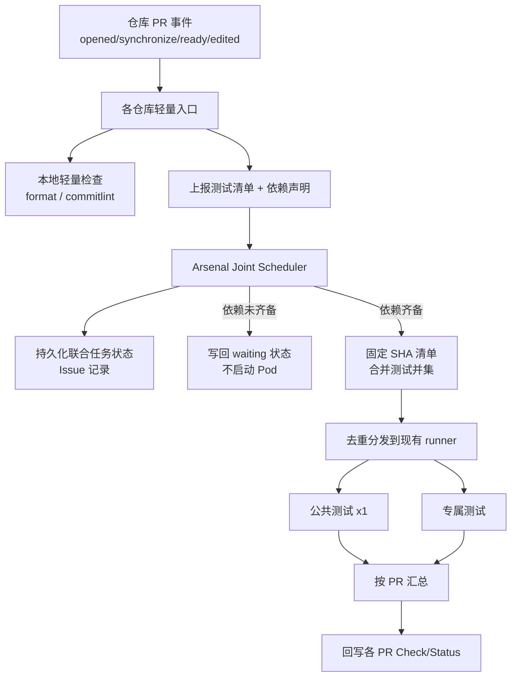

# 跨仓库联合 CI 设计方案

> 目标：Driver / Synapse / Sim 关联变更时，**公共测试只跑一次**，专属测试分别跑；调度收拢到 Arsenal；用依赖分支自动关联；等待时不占测试 Pod；状态先记在 Arsenal Issue。

## 1. 背景与问题

当前跨仓库提交通常要触发两次（或三次）独立 CI：

- 每个仓库各自跑一遍路由 → 各自调用 Arsenal 公共工作流
- 公共测试（如 MultiRepo / ARC MultiRepo / 部分 Pseudo）在代码组合相同的情况下会重复执行
- 浪费编译与实卡资源，合入节奏也被拉长

约束：

- 保留各仓库独立 PR 与审核记录
- 各仓库 CI 内容不完全相同（见下表），只能对「完全相同」的测试去重
- 合入不是原子操作；任一侧更新必须使旧联合结果失效

## 2. 仓库 CI 差异（现状基线）

| 仓库 | 主要 CI | 注意点 |
|---|---|---|
| Driver | 格式/提交检查、MultiRepo 实卡、Pseudo、多内核构建、VTPU UAT | 按改动范围选型；Pseudo 含 legacy / legacy_16card |
| Synapse | 格式/pre-commit、ARC_MultiRepo、Pseudo | 指定非默认 Driver 分支时改跑 MultiRepo_runtest |
| Sim | 格式/提交、Sim/Synapse 构建、ARC_MultiRepo、Pseudo | ARC 关闭 `enable_abs_unit`；HHP 目标启用 HHP simulator |

去重原则：**测试项 + 参数 + 环境 + 代码版本组合** 完全一致才算同一任务。同名但卡数/参数不同必须分发。

## 3. 总体架构



核心决策：

1. **调度权在 Arsenal**：各仓库只跑轻量检查 + 上报；重测试由 Arsenal 统一派发。
2. **事件驱动等待**：不轮询、不占 Pod；依赖齐备后再创建编译/测试任务。
3. **结果一对多回写**：同一次公共测试结果写到所有参与 PR 的对应 head SHA。

## 4. 关联与触发（自动，无评论命令）

### 4.1 依赖声明（复用现有字段）

Synapse / Sim PR 描述中已有类似：

```text
DLC_KERNEL_DRIVER_BRANCH=feature/xxx
DLC_SIM_BRANCH=feature/yyy
```

新增可选语义标记（PR 模板勾选或字段）：

```text
CI_MODE=joint
JOINT_WAIT=true
```

- `CI_MODE=joint`：耗资源测试等待联合调度，合入检查不得因「未跑」而 skipped 通过
- `JOINT_WAIT=true`：指定依赖分支属于「一起合入的改动」，缺 PR 时等待，而不是固定成普通依赖 SHA 直接跑

普通 PR 不带标记 → 保持现有单仓库流程。

### 4.2 触发时序（不依赖同时提 PR）

| 时间 | 事件 | 行为 |
|---|---|---|
| T0 | Synapse PR 创建，Driver 尚未有 PR | 轻量检查；记录「等待 Driver feature/xxx」；释放 Pod |
| T1 | Driver PR 创建 / Ready | 匹配等待中的联合任务；依赖齐备则启动一轮联合验证 |
| T2 | 任一侧 push | 旧联合结果失效；重新固定 SHA；再跑一轮 |
| — | 无跨仓依赖 | 走现有单仓 CI |

### 4.3 匹配规则

| 情况 | 处理 |
|---|---|
| 无跨仓依赖 | 单仓 CI |
| 依赖分支唯一开放 PR，且双方声明一致 | 自动联合 |
| 分支存在但无 PR，且 `JOINT_WAIT=true` | 等待 |
| 分支存在但无 PR，且非联合等待 | 固定该分支 tip SHA 作依赖（兼容现状） |
| 分支找不到 / 多个 PR / 声明冲突 | 检查失败并给出原因，不启动重测试 |
| 关联 PR 仍为 Draft | 仅轻量检查；全部 Ready 后再跑重测试 |

边界：第一笔 PR 未声明联合依赖就已独立测完，后来才出现第二笔关联改动 → 无法预知；新组合仍需验证，仅输入完全相同的任务可复用。

## 5. 测试清单合并与分发

### 5.1 各仓上报

复用现有 `determine_workflows_*.sh` / `ci_router` 路由逻辑，输出结构化清单，例如：

```json
{
  "repo": "synapse",
  "pr": 456,
  "head_sha": "abc...",
  "base_ref": "main",
  "deps": {"driver_branch": "feature/xxx", "sim_branch": "feature/yyy"},
  "ci_mode": "joint",
  "tests": [
    {"id": "multirepo_runtest", "params": {"suite": "default"}, "exclusive_to": null},
    {"id": "pseudo", "params": {"cards": 4, "suite": "default"}, "exclusive_to": null},
    {"id": "format", "local": true}
  ]
}
```

`local: true` 的继续在各仓跑；其余交给 Arsenal。

### 5.2 Arsenal 合并

1. 固定版本清单（各 PR head SHA + 未参与仓库选定 SHA + Arsenal/镜像版本）
2. 生成 `joint_key = hash(versions + test_config + image)`
3. 展开测试并集；按 `(test_id, params, env, versions)` 去重
4. 同一 `joint_key` 已有运行中/有效结果 → 复用或等待，不重复派发
5. 对同一联合组串行化状态机，防止双边事件并发双派发

### 5.3 分发映射（示例：Driver + Synapse）

| 合并后任务 | Runner | 结果归属 |
|---|---|---|
| 实卡 MultiRepo | 现有实卡 runner | Driver + Synapse |
| 相同 Pseudo 套件 | Pseudo runner | Driver + Synapse |
| Driver Pseudo 16 卡 | 16 卡 runner | 仅 Driver |
| 多内核构建 | 现有构建 runner | 仅 Driver |

构建产物复用条件：构建输入与配置完全相同。

### 5.4 按 PR 汇总

```text
Driver 合入 = Driver 本地检查 + 公共测试 + Driver 专属
Synapse 合入 = Synapse 本地检查 + 公共测试 + Synapse 专属
```

公共失败 → 双方都不能通过；专属失败 → 仅影响对应 PR。另设「联合就绪」检查，供协调合入使用。

## 6. 状态存储（第一版）

不新建数据库。Arsenal 仓库内每组联合任务对应一条机器人维护的 Issue：

```text
联合任务：joint-001
参与 PR：Synapse#456
等待：Driver feature/xxx
状态：waiting_deps | ready | running | succeeded | failed | invalidated
验证版本：...
workflow_run：...
```

| 信息 | 位置 |
|---|---|
| 关联关系 / 等待依赖 / 任务状态 | Arsenal Joint Issue |
| PR 上展示的 waiting/success/failure | 各 head SHA 的 Check / Status |
| 日志与产物 | Actions run + 现有产物存储 |

调度任务每次事件唤醒后：**读 Issue → 重新查询实时 PR/SHA → 决策 → 写回 → 退出**。Issue 只是关联缓存，放行必须以重新核对为准。

## 7. 结果回写与失效

- 使用安装在各仓的 GitHub App，向指定 `head_sha` 写 Check Run / Commit Status
- 任一参与 PR 更新、目标分支基线变化、镜像/测试配置变化 → `invalidated`
- 失效时：各 PR 联合检查回到 `pending/waiting`，**不能**用 skipped 冒充通过
- 重跑策略（v1）：代码更新后自动调度新一轮；同一输入失败可重试失败项

合入：

- 测试通过 ≠ 自动合入；发起测试与合入是两个动作
- 合入前再核对双方 SHA、审批、检查；分别合入，指定 expected head SHA
- 一边成功一边失败必须记录并告警

## 8. 实现落点（代码改动面）

### 8.1 各业务仓（Driver / Synapse / Sim）

- `ci_router`：识别 `CI_MODE=joint`，跳过重测试自动触发，改为上报
- 轻量 `issue`/`pull_request` 工作流：解析依赖字段、校验权限、调用 Arsenal `workflow_dispatch` 或 repository_dispatch
- PR 模板：补充联合合入选项

### 8.2 Arsenal

- 新增 `joint_ci.yml`（或等价入口）
- 联合调度模块：
  - 解析/匹配依赖 PR
  - Issue 状态机
  - 版本清单与 `joint_key`
  - 测试并集与去重
  - 派发现有 `MultiRepo_runtest` / `ARC_MultiRepo_runtest` / `Pseudo_*` 等，**强制显式 SHA 输入**（禁止再依赖 `github.head_ref` / 偶然 PR body）
  - 结果映射与跨仓回写
- 并发锁：同一 `joint_id` 串行处理

### 8.3 现有公共工作流

- 补充明确的多仓库 SHA inputs
- 输出稳定的结果工件（供汇总 job 消费）

## 9. 分阶段落地

| 阶段 | 范围 | 成功标准 |
|---|---|---|
| P0 设计冻结 | 本文件 + 实验计划 | 评审通过 |
| P1 骨架 | Arsenal joint 入口 + Issue 状态机 + 假分发 | 能完整走 waiting→running→回写 |
| P2 真实去重 | 接入 MultiRepo / Pseudo 显式 SHA | Driver+Synapse 联合只跑一份公共测试 |
| P3 自动关联 | 依赖字段自动匹配 + Ready 门闸 | 无需评论命令；错峰提 PR 也能只跑一轮 |
| P4 Sim +  harden | 三仓并集、失效/冲突/取消 | 实验矩阵全绿 |

## 10. 非目标（v1）

- 跨仓原子合入
- 新建独立数据库 / 控制面服务
- 用时间窗（如 60s）凑单触发
- 等待依赖时占用测试 Pod

## 11. 风险与缓解

| 风险 | 缓解 |
|---|---|
| 误把不同参数的同名测试去重 | 去重键包含 params/env/versions；单测覆盖 |
| 双边事件双派发 | joint_id 串行锁 + joint_key 复用 |
| Check 用 skipped 放行 | joint 模式下未完成一律 pending/fail |
| App 权限不足跨仓写状态 | 安装同一 GitHub App 到三仓+Arsenal |
| 历史 PR 未声明联合已跑完 | 文档约定：跨仓改动先建 Draft 并声明 |

## 12. 开放问题（实现前确认）

1. 联合任务 Issue 放在 Arsenal 哪个 repo / 是否用 label 约定？
2. GitHub App 现成凭证名与可写仓库列表？
3. 第一版优先配对：仅 Driver↔Synapse，还是三仓一起？
4. 「联合就绪」是否作为 branch protection required check？
