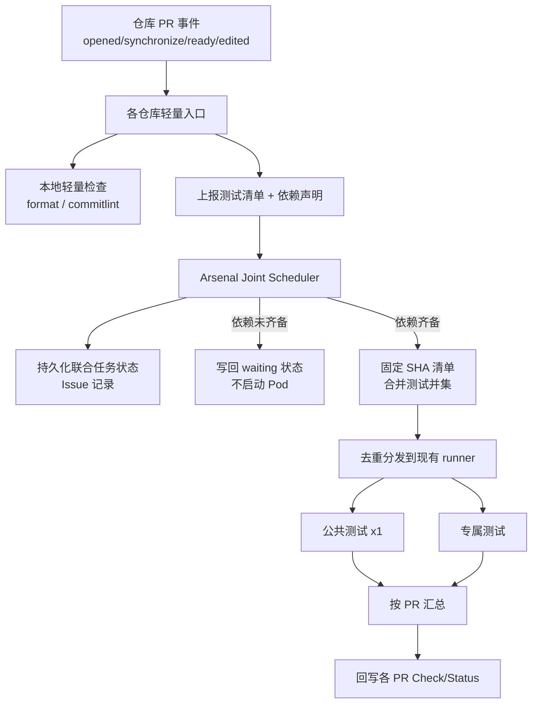
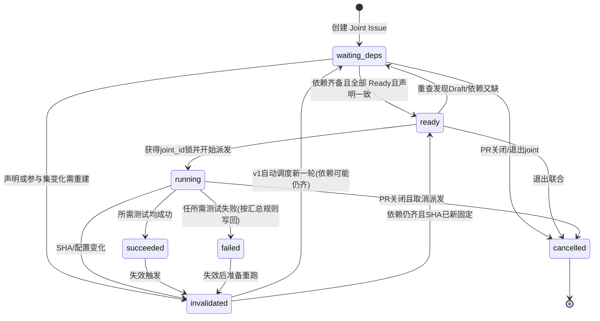

# 跨仓库联合 CI 设计方案

> 目标：Driver / Synapse / Sim 关联变更时，**公共测试只跑一次**，专属测试分别跑；调度收拢到 Arsenal；用依赖分支自动关联；等待时不占测试 Pod；状态先记在 Arsenal Issue。

## 0. 实验边界与硬约束

| 约束 | 说明 |
|---|---|
| 验证范围 | **本实验仅在个人号私有仓验证**（见下表），不碰 ChipLTech / 公司现网仓库 |
| 工作区 | 只改 `/workspace/joint-ci` 下文档与本地 prototype；本地稳定后由协调者同步推到 `joint-ci-lab`；**禁止**自行 `git push`、禁止改动或推送任何 ChipLTech/公司仓库 |
| 代码改动面 | 当前阶段以文档 + prototype + mock 仓为准，**不改业务仓现网代码** |
| 术语对齐 | 与 `experiments.md`、`prototype/shared/joint_schema.md`、`joint_key.py` 一致 |
| 客户端 | **实验期默认 fake GhClient**（dry-run），暂不配真实 GitHub App；真连时只用下表 `zhekui-hub/joint-ci-*` 私有仓 |
| 证据边界 | **fake / 本地 dry-run 只能证明调度逻辑、状态机、去重键、汇总规则**；权限、Check 回写、Actions 派发、等待不占真实 runner、跨仓事件时序必须真联调。详见 [`experiments.md` §0](./experiments.md) |

### 0.1 实验仓坐标（个人号 `zhekui-hub`，全私有，非公司仓）

| 角色 | 仓库 | 对应现网概念 |
|---|---|---|
| 主仓 / Arsenal 实验床 | https://github.com/zhekui-hub/joint-ci-lab | Arsenal（设计+原型+Joint Issue） |
| Driver mock | https://github.com/zhekui-hub/joint-ci-driver | Driver |
| Synapse mock | https://github.com/zhekui-hub/joint-ci-synapse | Synapse |
| Sim mock | https://github.com/zhekui-hub/joint-ci-sim | Sim |

约定：
- `report.repo` 实验中取 `driver` / `synapse` / `sim`（或完整 `zhekui-hub/joint-ci-*`，实现与实验侧统一一种）
- Joint Issue 落在 **https://github.com/zhekui-hub/joint-ci-lab**，label `joint-ci`
- 本地只改 `/workspace/joint-ci`；稳定后由协调者同步推到 `joint-ci-lab`
- **禁止**碰 ChipLTech / 公司现网仓

## 1. 背景与问题

当前跨仓库提交通常要触发两次（或三次）独立 CI：

- 每个仓库各自跑一遍路由 → 各自调用 Arsenal 公共工作流
- 公共测试（如 MultiRepo / ARC MultiRepo / 部分 Pseudo）在代码组合相同的情况下会重复执行
- 浪费编译与实卡资源，合入节奏也被拉长

约束：

- 保留各仓库独立 PR 与审核记录
- 各仓库 CI 内容不完全相同（见下表），只能对「完全相同」的测试去重
- 合入不是原子操作；任一侧更新必须使旧联合结果失效

## 2. 仓库 CI 差异（现状基线）

| 仓库 | 主要 CI | 注意点 |
|---|---|---|
| Driver | 格式/提交检查、MultiRepo 实卡、Pseudo、多内核构建、VTPU UAT | 按改动范围选型；Pseudo 含 legacy / legacy_16card |
| Synapse | 格式/pre-commit、ARC_MultiRepo、Pseudo | 指定非默认 Driver 分支时改跑 MultiRepo_runtest |
| Sim | 格式/提交、Sim/Synapse 构建、ARC_MultiRepo、Pseudo | ARC 关闭 `enable_abs_unit`；HHP 目标启用 HHP simulator |

去重原则：**测试项 + 参数 + 环境 + 代码版本组合** 完全一致才算同一任务。同名但卡数/参数不同必须分发。

## 3. 总体架构



核心决策：

1. **调度权在 Arsenal**：各仓库只跑轻量检查 + 上报；重测试由 Arsenal 统一派发。
2. **事件驱动等待**：不轮询、不占 Pod；依赖齐备后再创建编译/测试任务。
3. **结果一对多回写**：同一次公共测试结果写到所有参与 PR 的对应 head SHA。

## 4. 关联与触发（自动，无评论命令）

### 4.1 依赖字段解析

Synapse / Sim PR 描述（及 CI 环境变量）复用现有字段：

| 字段 | 来源 | 语义 |
|---|---|---|
| `DLC_KERNEL_DRIVER_BRANCH` | PR body / env | 映射为 report `deps.driver_branch` |
| `DLC_SIM_BRANCH` | PR body / env | 映射为 report `deps.sim_branch` |
| `CI_MODE` | PR 模板勾选或字段 | `joint` = 走联合调度；缺省/其他 = 单仓流程 |
| `JOINT_WAIT` | PR 模板或字段 | `true` = 依赖缺 PR 时等待；否则按 tip SHA 固定依赖（兼容现状） |

解析规则（可落地）：

1. 从 PR body 正则提取 `KEY=value`（大小写不敏感键名，值去空白）。
2. `CI_MODE=joint` 时才进入联合路径；否则**不创建** Joint Issue。
3. `JOINT_WAIT` 缺省：若 `CI_MODE=joint` 且声明了跨仓分支，**建议默认 `true`**（可配置）；显式 `false` 则走固定 tip。
4. Driver 侧通常无反向分支字段；由调度器根据「对方声明的分支名 == 本 PR head 分支」反向匹配。

上报 payload 对齐 `joint_schema.md`：

```json
{
  "schema_version": 1,
  "repo": "synapse",
  "pr_number": 456,
  "head_sha": "abc",
  "base_ref": "main",
  "ci_mode": "joint",
  "joint_wait": true,
  "deps": {
    "driver_branch": "feature/xxx",
    "sim_branch": null
  },
  "local_tests": ["format", "commitlint"],
  "remote_tests": [
    {"id": "multirepo_runtest", "params": {"profile": "default"}, "exclusive_to": null}
  ]
}
```

语义标记：

- `CI_MODE=joint`：耗资源测试等待联合调度；合入检查**不得**因「未跑」而 `skipped` 通过
- `JOINT_WAIT=true`：指定依赖分支属于「一起合入的改动」，缺 PR 时等待，而不是固定成普通依赖 SHA 直接跑

普通 PR 不带标记 → 保持现有单仓库流程（E1）。

### 4.2 触发时序（错峰提 PR：先等后齐）

不要求双方同时开 PR。调度循环每次事件唤醒后退出，**等待期不占测试 Pod**。

| 时间 | 事件 | 行为 |
|---|---|---|
| T0 | Synapse PR 创建，`CI_MODE=joint` + `JOINT_WAIT`，Driver 尚未有 PR | 轻量检查；创建/更新 Joint Issue → `waiting_deps`；各 head 写 Check `pending`；**释放 Pod** |
| T1 | Driver PR 创建 / Ready（同分支） | 匹配等待中的联合任务；依赖齐备且全部 Ready → `ready` → `running`；只派发一轮公共测试 |
| T2 | 任一侧 `synchronize`（push） | 旧联合结果 `invalidated`；重新固定 SHA；再跑一轮 |
| T3 | 关联 PR 仍为 Draft | 保持 `waiting_deps`（reason=draft）；仅轻量检查 |
| — | 无跨仓依赖 / 非 joint | 走现有单仓 CI |

对应实验：E2（错峰等待）、E7（Draft 门闸）。

### 4.3 匹配算法

输入：当前上报的 report + GitHub API 实时查询。

```text
对每个 deps.<repo>_branch = B：
  1. list open PRs where head.ref == B（目标仓）
  2. 过滤：state=open；可选过滤 base
  3. 计数：
     - 0 个 → 若 joint_wait：记入 waiting_for；否则取 branch tip SHA 作固定依赖（E8）
     - 1 个 → 候选参与者；继续 Draft / 声明一致性校验
     - >1 个 → 歧义失败（E6），写 Check failure，不派发
```

| 情况 | 处理 | Check |
|---|---|---|
| 无跨仓依赖 / 非 joint | 单仓 CI | 现有 |
| 依赖分支**唯一**开放 PR，且双方声明一致 | 自动联合 | pending → 最终 success/failure |
| 分支存在但无 PR，且 `JOINT_WAIT=true` | 等待 | pending（waiting） |
| 分支存在但无 PR，且非联合等待 | 固定该分支 tip SHA（兼容现状） | 按单边流程 |
| 分支找不到 | 失败 | failure，说明原因 |
| 同分支多个开放 PR | 歧义失败，不启动重测试 | failure（多 PR 歧义） |
| 声明冲突（见 4.5） | 失败 | failure（声明冲突） |
| 关联 PR 仍为 Draft | 仅轻量；全部 Ready 后再跑重测试 | pending |

边界：第一笔 PR 未声明联合依赖就已独立测完，后来才出现第二笔关联改动 → 无法预知；新组合仍需验证，仅输入完全相同的任务可复用。

### 4.4 joint_id 生成与稳定（对齐 prototype）

目标：**双边错峰上报只对应一条 Issue**，避免各建一条。

| 规则 | 说明 |
|---|---|
| 查找优先 | 调度器先按「参与分支集合 / 已有 label=`joint-ci` 的开放 Issue」查找；命中则复用 `joint_id` |
| 确定性 ID（建议） | `joint_id = "joint-" + sha1(canonical(sorted_pairs))[:12]`，其中 `sorted_pairs` 为已声明的 `(repo, branch)` 有序列表（含本 PR） |
| 回退 | 若仅单侧已出现、对侧分支名已知：用「本仓+对侧声明分支」生成同一确定性 ID，对侧后来上报时算出相同值 |
| prototype 现状 | `scheduler.py` 可用显式 `JOINT_ID` / payload `joint_id`；缺省 `joint-auto-{repo}-{pr}`。落地时**以确定性 ID + Issue 查找**为准，避免双 Issue |
| 与 joint_key 区别 | `joint_id` 标识「这一组关联 PR」；`joint_key` 标识「这一组固定 SHA + 镜像 + 测试配置」的一次验证输入 |

并发：同一 `joint_id` 必须串行处理（见 §6.4）。

### 4.5 双向声明一致性校验

在依赖齐备、进入 `ready` 之前执行：

| 校验 | 通过条件 | 失败处理 |
|---|---|---|
| 正向匹配 | A 声明的 `deps.X_branch` == X 仓参与 PR 的 head 分支名 | failure：分支名不一致 |
| 反向（若双方都声明） | B 声明的依赖指向 A 的分支（或显式留空表示接受对方声明） | failure：声明冲突 |
| 单边声明 | 仅 Synapse/Sim 声明 Driver 分支，Driver 未写反向字段 → **允许**（常见） | — |
| CI_MODE | 所有拟参与 PR 均为 `joint`（或调度器认可的等价标记） | 非 joint 侧不纳入；必要时取消联合 |
| Draft | 全部 `is_draft=false` 才进入重测试 | 否则 waiting_deps |

失败时：Issue → 可记 `failed` 或保持 `waiting_deps` 并写清晰原因；**禁止**派发重测试；Check 用 `failure`（带原因），不用 `skipped`。

## 5. 测试清单合并与分发

### 5.1 各仓上报

复用现有 `determine_workflows_*.sh` / `ci_router` 路由逻辑，输出结构化清单（见 §4.1 schema）。

`local: true` / `local_tests` 继续在各仓跑；`remote_tests` 交给 Arsenal。

### 5.2 去重键与 joint_key（对齐 `joint_key.py`）

**单测任务去重键**（`test_identity`）：

```text
(test_id, canonical_json(params), canonical_json(env))
```

- `canonical_json`：`json.dumps(..., sort_keys=True, separators=(",", ":"), ensure_ascii=False)`
- 同名不同卡数/参数 → 不同键 → **必须分发多条**（E4）

**joint_key**（一次联合验证输入指纹）：

```text
joint_key = "joint-" + sha256(canonical_json({
  "versions": {repo: head_sha, ...},  # 参与仓 + 固定依赖 tip
  "image": <runner/image 标识>,
  "test_config_hash": <合并后测试配置摘要>
})).hexdigest()[:16]
```

`versions` / `image` / `test_config` 任一变化 → 新 `joint_key` → 旧结果不可复用（E5）。

### 5.3 `merge_remote_tests` 语义

对齐 prototype：

1. 遍历各 report 的 `remote_tests`，按 `test_identity` 并集折叠。
2. 首次出现：写入 `id/params/env`，`consumers=[]`，带上 `exclusive_to`。
3. 再次出现相同 identity：只追加 `consumers: [{repo, pr}, ...]`；若任一侧带 `exclusive_to`，保留该收窄标记。
4. 输出：每条合并任务只派发 **一次**。

| 字段 | 含义 |
|---|---|
| `consumers` | 哪些 PR 需要该结果（一对多回写） |
| `exclusive_to` | 非空时表示专属某仓；汇总时不得广播失败到其他仓 |

伪代码级步骤（Arsenal 合并）：

1. 固定版本清单（各 PR head SHA + 未参与仓库选定 SHA + Arsenal/镜像版本）
2. `merge_remote_tests(reports)` → 并集
3. `make_joint_key(versions, image, test_config_hash)`
4. 若同 `joint_key` 已有 `running` / 有效 `succeeded` → **复用或等待，禁止双派发**
5. 对同一 `joint_id` 串行化状态机

### 5.4 分发映射（示例：Driver + Synapse）

| 合并后任务 | Runner | consumers | 结果归属 |
|---|---|---|---|
| 实卡 MultiRepo | 现有实卡 runner | driver+synapse | 双方 |
| 相同 Pseudo 套件 | Pseudo runner | driver+synapse | 双方 |
| Driver Pseudo 16 卡 | 16 卡 runner | driver（exclusive） | **仅 Driver** |
| 多内核构建 | 现有构建 runner | driver | 仅 Driver |

构建产物复用条件：构建输入与配置完全相同。

### 5.5 按 PR 汇总（公共 vs 专属）

使用 `per_pr_required(report, merged_tests)`：只取该 PR 上报清单里出现过的 identity。

```text
Driver 合入 = Driver 本地检查 + 其 required 远程测试（含公共 + Driver 专属）
Synapse 合入 = Synapse 本地检查 + 其 required 远程测试（含公共 + Synapse 专属）
```

| 结果 | Driver Check | Synapse Check |
|---|---|---|
| 公共失败 | failure | failure |
| 仅 Driver 专属失败 | failure | 仍可 success（若其 required 均过） |
| 全部通过 | success | success |
| 联合未完成 | pending | pending（禁止 skipped 冒充通过） |

另设「联合就绪」检查（见 §12 建议），供协调合入使用。

### 5.6 同一 joint_key：复用 / 等待 / 禁止双派发

| 已有状态 | 新事件 | 行为 |
|---|---|---|
| 同 joint_key `running` | 对侧再次上报 | 不派发；挂到同一 workflow_runs；Check 保持 pending |
| 同 joint_key 有效 `succeeded` | 参与 SHA 未变 | 直接复用结果回写 |
| joint_key 变化 | 任一 SHA/镜像/配置变 | 旧结果 invalidated；新 key 新一轮 |
| 不同 joint_id 偶然同 key | 罕见；按 key 复用结果，Issue 仍分属各组 | 以 key 防双跑为准 |

## 6. 状态存储与 Issue 状态机（第一版）

不新建数据库。实验床 `joint-ci-lab`（对应 Arsenal）内每组联合任务对应一条机器人维护的 Issue（label `joint-ci`，见 §12）。

### 6.1 完整状态

```text
waiting_deps → ready → running → succeeded | failed
                 ↘ invalidated | cancelled（可从非终态切入）
```



### 6.2 状态表：进入 / 退出 / Check 写回

| 状态 | 进入条件 | 退出条件 | 各 PR Check（joint-ci） |
|---|---|---|---|
| `waiting_deps` | 缺依赖 PR；或存在 Draft；或仅单侧上报 | 依赖唯一匹配 + 全 Ready + 声明一致 → `ready`；关闭/退出 → `cancelled` | **pending**（文案说明 waiting）；禁止 skipped |
| `ready` | 上表齐备；已固定拟用 versions，尚未派发 | 抢到串行锁 → `running`；重查失败回 `waiting_deps` | pending |
| `running` | 已 `dispatch` 至少一条远程测试；记录 workflow_runs | 汇总完成 → `succeeded`/`failed`；失效/取消 | pending |
| `succeeded` | 该联合所需测试均成功（按合并任务） | 失效 → `invalidated` | **success**（按 PR 汇总后；专属失败见下） |
| `failed` | 存在失败且影响放行 | 失效 → `invalidated`；或同输入重试策略 | **failure**（仅失败影响到的 PR；公共失败则双方 failure） |
| `invalidated` | 见 §7 触发列表 | v1：自动进入新一轮（`waiting_deps` 或 `ready`） | 旧结论作废；回到 **pending** |
| `cancelled` | PR 关闭、去掉 `CI_MODE=joint`、人工取消 | 终态 | 不再用该联合结果放行；对侧 pending/failure 并提示关联解除 |

注意：

- Check conclusion **禁止**用 `skipped` 表示「联合未跑完但可合入」。
- 按 PR 汇总时：公共失败 → 双方 failure；专属失败 → 仅 `exclusive_to` / consumers 对应方 failure（E4）。
- `succeeded`/`failed` 是 Issue 级粗状态；各 PR Check 以 `per_pr_required` 为准。

### 6.3 调度循环（事件驱动、不占 Pod）

每次 `workflow_dispatch` / `repository_dispatch` / PR 事件唤醒 Arsenal job：

```text
1. 解析上报 report(s)
2. 解析或创建 joint_id；加载 Issue body 中的机器状态
3. 获取同一 joint_id 串行锁（拿不到则短退出或排队，不占测试 Pod）
4. 读 Issue 状态
5. 重查实时 PR / head SHA / draft / 开放 PR 列表 / body 声明
6. 决策：等待 | 就绪派发 | 复用 joint_key | 失效 | 取消
7. 写回 Issue（frontmatter + 人类可读摘要）
8. 写回各 head SHA 的 Check Run / Status
9. 释放锁；进程退出
```

原则：**Issue 只是关联缓存，放行必须以重新核对为准。** 等待依赖时 job 退出，不 sleep 占机（E2：`pod_wait_seconds ≈ 0`）。

### 6.4 Issue body 机器可读 frontmatter

对齐 prototype `<!-- joint-ci-state ... -->`：

```markdown
<!-- joint-ci-state
{
  "joint_id": "joint-a1b2c3d4e5f6",
  "status": "waiting_deps",
  "participants": [ /* reports 摘要或引用 */ ],
  "waiting_for": [{"repo": "driver", "branch": "feature/xxx"}],
  "versions": {},
  "joint_key": null,
  "workflow_runs": {},
  "issue_number": 123
}
-->

## Joint `joint-a1b2c3d4e5f6`

- status: `waiting_deps`
- joint_key: `null`
- waiting_for: ...
- versions: ...
```

| 信息 | 位置 |
|---|---|
| 关联关系 / 等待依赖 / 任务状态 | Arsenal Joint Issue（上表 frontmatter） |
| PR 上展示的 waiting/success/failure | 各 head SHA 的 Check / Status |
| 日志与产物 | Actions run + 现有产物存储 |

### 6.5 并发：同一 joint_id 串行锁

| 机制 | 要求 |
|---|---|
| 锁粒度 | `joint_id`（不是全仓库一把锁） |
| 实现建议 | Issue 标题/body 中的 `lock_token`+过期时间，或 Actions `concurrency: joint-${{ joint_id }}` |
| 持锁方 | 仅持锁调度循环可改状态 / 派发 |
| 目的 | 防止双边事件并发双派发（与 joint_key 复用双保险） |

## 7. 结果回写与失效

### 7.1 回写

- 使用安装在各仓的 GitHub App，向指定 `head_sha` 写 Check Run / Commit Status
- 公共测试：同一 `workflow_run` URL 写到所有 `consumers` 的对应 Check
- 合入前再核对双方 SHA、审批、检查；分别合入，指定 expected head SHA
- 一边成功一边失败必须记录并告警
- 测试通过 ≠ 自动合入；发起测试与合入是两个动作

### 7.2 失效触发列表

任一成立 → 当前联合结果标记 `invalidated`：

| # | 触发 | 说明 |
|---|---|---|
| 1 | 任一参与 PR head SHA 变化 / `synchronize` | 最常见（E5） |
| 2 | base 分支 tip 变化（若 tip 已纳入 `versions`） | 基线漂移 |
| 3 | 镜像或测试配置变化导致 `joint_key` 变 | image / test_config_hash |
| 4 | 依赖声明变更（分支名、CI_MODE、JOINT_WAIT） | 参与集或等待语义变 |
| 5 | 退出 joint（去掉 `CI_MODE=joint`） | 关联解除 → 常伴随 `cancelled` |
| 6 | 参与 PR 关闭 | `cancelled`；对侧停止用该结果放行（E9） |
| 7 | Draft ↔ Ready 变化 | Ready→Draft：停止重测/失效中；Draft→Ready：可能从 waiting 进入 ready（E7） |

### 7.3 失效效果（v1）

| 动作 | 要求 |
|---|---|
| Issue | `status=invalidated`（或随即转入新一轮 waiting/ready） |
| Checks | 各相关 PR 联合检查回到 **pending/waiting**；清除「旧绿勾」可用性 |
| 派发 | 自动调度新一轮（重新固定 SHA、算新 joint_key） |
| 进行中的 run | 能取消则取消；不能取消则结果**不得**用于合入 |
| 合入告警 | 一边已合入、另一边失效/失败 → 必须告警 |

### 7.4 什么不变则不失效

同时满足则**保持**有效结果、可复用 `joint_key`：

- 所有参与 PR 的 head SHA 不变
- 纳入 versions 的依赖 tip / base tip 不变
- image 与 test_config_hash 不变（合并后 remote 测试集合语义不变）
- 依赖声明与参与 PR 集合不变
- 无退出 joint / 关闭 PR / 回到 Draft

仅重新打开调度循环做「重查确认」不算失效。

### 7.5 重跑策略（v1）

- 代码更新（SHA 变）→ 自动新一轮
- 同一输入（同 joint_key）失败 → 可重试失败项；成功项可按 key 复用
- 不使用时间窗凑单；不靠评论命令触发

## 8. 实现落点（代码改动面）

> 提醒：实验阶段只在 `zhekui-hub/joint-ci-*` 与 `/workspace/joint-ci` 演进（默认 fake GhClient）；迁入公司 Arsenal 前需协调者批准。

### 8.1 各业务仓（Driver / Synapse / Sim）

- `ci_router`：识别 `CI_MODE=joint`，跳过重测试自动触发，改为上报
- 轻量 `issue`/`pull_request` 工作流：解析依赖字段、校验权限、调用 Arsenal `workflow_dispatch` 或 repository_dispatch
- PR 模板：补充联合合入选项

### 8.2 Arsenal

- 新增 `joint_ci.yml`（或等价入口）
- 联合调度模块（prototype → `joint_ci/scheduler.py`）：
  - 解析/匹配依赖 PR（§4）
  - Issue 状态机（§6）
  - 版本清单与 `joint_key`（§5）
  - 测试并集与去重（`merge_remote_tests`）
  - 派发现有 `MultiRepo_runtest` / `ARC_MultiRepo_runtest` / `Pseudo_*` 等，**强制显式 SHA 输入**（禁止再依赖 `github.head_ref` / 偶然 PR body）
  - 结果映射与跨仓回写
- 并发锁：同一 `joint_id` 串行处理

### 8.3 现有公共工作流

- 补充明确的多仓库 SHA inputs
- 输出稳定的结果工件（供汇总 job 消费）

## 9. 分阶段落地

与 `experiments.md` §4 门禁对齐。实验分两层，**禁止混用证据**：

- **烟雾 / 逻辑（fake）**：E1–E10 宣称层 + 大矩阵 F/R 中 `fake|both`；只证明调度逻辑、状态机、去重键、汇总规则。
- **可行性（真联调）**：P-* + 标 `real` 的 F/R + E2/E3/E5 真跑 `zhekui-hub/joint-ci-*`。fake 全绿 **不得**宣称生产可行。

### 9.1 总表

| 阶段 | 范围 | 交付物 | 成功标准 | 烟雾/逻辑门禁（fake） | 可行性门禁（真联调） | 依赖 | 回滚 |
|---|---|---|---|---|---|---|---|
| **P0** 设计冻结 | 本文件 + 实验计划 | `docs/design.md`、`docs/experiments.md`、prototype 对齐说明 | 评审通过；开放问题有建议默认值；证据边界写死 | 文档评审（含 experiments §0） | 无 | 无 | 仅文档，回滚=还原文档 |
| **P1** 骨架 | Arsenal joint 入口 + Issue 状态机 + 假分发 | `joint_ci.yml`、scheduler dry-run、Issue frontmatter、Check pending 写回 | 完整走 `waiting_deps→ready→running→回写`；fake 下未 dispatch | **E2 fake**：未 dispatch + 状态机 | 不要求（不可用 fake 宣称真实 runner 空闲） | P0；`joint-ci-lab` + fake GhClient（真连仅 zhekui-hub 白名单） | 关掉 joint 入口 workflow；PR 去掉 CI_MODE 即回单仓 |
| **P2** 真实去重 | 接入 MultiRepo / Pseudo 显式 SHA | 真实 dispatch；`joint_key` 复用；按 PR 汇总 | Driver↔Synapse 联合只跑一份公共测试；专属隔离 | **E3+E4 自动化绿（逻辑）**；E1 回归；F6/F7/F8 fake | 同源 Check URL、Actions `public_runs=1` 记入可行性，不记入 fake | P1；公共工作流接受显式 SHA | 回退为各仓自行触发重测；保留 Issue 但不派发 |
| **P3** 自动关联 | 依赖字段自动匹配 + Ready 门闸 + 失效 | 匹配算法、Draft 门闸、invalidate 自动重跑 | 无需评论命令；错峰只跑一轮；push 后旧结果失效 | **E2+E5+E7 fake 部分绿** | **E2/E3/E5 真联调** + P3 显式 SHA；真实队列不占机、旧绿勾失效 | P2；字段解析与 PR 模板 | 关闭自动匹配，临时改手动指定 joint_id |
| **P4** Sim + harden | 三仓并集、冲突/取消、硬化 | Sim 并入；歧义/关闭路径；实验脚手架 | 烟雾 + 逻辑 PASS；迁公司仓还要可行性 PASS | **E6+E9+E10 绿**；E1/E8 回归；F/R 中 fake\|both 全绿 | **可行性 PASS**：P1–P5 + F14/F15/F16 + E2/E3/E5 real | P3；Sim 仓 joint 上报 | 三仓开关分仓关闭；Sim 先退出联合 |

推荐配对顺序（§12）：**P2/P3 先 Driver↔Synapse，P4 再 Sim**。

### 9.2 各阶段成功标准（可执行）

分层定义见 `experiments.md` §3.4 / §4：**烟雾 PASS** / **逻辑 PASS** / **可行性 PASS**。下表括号内为证据层。

**P0**

- [ ] §4–§7 规则可实现，不依赖读代码猜语义
- [ ] 与 experiments E1–E10 及大矩阵 F/R/P 术语一致
- [x] 确认「仅 zhekui-hub/joint-ci-* 私有仓验证」写入 §0（协调者已定案）
- [ ] 确认证据边界：fake ≠ 生产可行（experiments §0）

**P1**（进本阶段：E2 fake 绿即可；可行性不挡编码）

- [ ] 创建 label=`joint-ci` Issue，frontmatter 可解析（fake 可先证逻辑）
- [ ] 缺依赖时 Check=pending 且 **未 dispatch**（fake）；无真实 runner 占用属可行性
- [ ] dry-run 派发写入 `workflow_runs`（fake）

**P2**（进本阶段：E3+E4 + F6/F7/F8 逻辑绿；同源 URL 不计入 fake）

- [ ] `public_runs=1` 逻辑计数（E3，fake）；Actions 实跑次数（可行性）
- [ ] 专属失败不广播（E4，fake；Check 可见性 real）
- [ ] 同 joint_key 不双派发（F8，both）

**P3**（进本阶段：E2+E5+E7 fake 部分绿；关「不占真实机 / 旧绿勾」必须真联调）

- [ ] 错峰自动关联（E2 fake）；真实队列空闲 + 错峰仍关联（E2/P4 real）
- [ ] synchronize → invalidated → 新 joint_key（E5 fake）；旧绿勾不可合入（E5 real）
- [ ] Draft 不跑重测，Ready 后启动（E7；无真实 job 为 real）

**P4**（harden：逻辑 PASS；迁公司仓还要可行性 PASS）

- [ ] 多 PR 歧义 failure（E6 / F2）
- [ ] 关闭/退出 cancelled（E9 / F5 / F13）
- [ ] 三仓并集正确，Sim 配置不误删 Synapse 子项（E10 / F12）
- [ ] 可行性：P1–P5、F14/F15/F16、E2/E3/E5 真联调绿

## 10. 非目标（v1）

- 跨仓原子合入
- 新建独立数据库 / 控制面服务
- 用时间窗（如 60s）凑单触发
- 等待依赖时占用测试 Pod
- 在 ChipLTech / 公司现网仓做验证或推送

## 11. 风险与缓解

| 风险 | 缓解 |
|---|---|
| 误把不同参数的同名测试去重 | 去重键含 params/env；versions/image 进 joint_key；`test_joint_key.py` 覆盖 |
| 双边事件双派发 | joint_id 串行锁 + joint_key 复用/等待 |
| Check 用 skipped 放行 | joint 模式下未完成一律 pending；失败用 failure |
| App 权限不足跨仓写状态 | 实验期用 fake GhClient；真连时同一凭证仅绑 `zhekui-hub/joint-ci-*`；现网另行审批 |
| 历史 PR 未声明联合已跑完 | 文档约定：跨仓改动先建 Draft 并声明 |
| 确定性 joint_id 碰撞/分叉 | 先搜开放 Issue 再创建；ID 含排序后的 (repo,branch) |
| 误连公司现网仓 | §0 硬约束；凭证与仓库白名单仅 `zhekui-hub/joint-ci-*` |
| base tip 频繁变导致过度失效 | versions 是否纳入 base tip 可配置；默认仅参与 PR SHA + 显式依赖 tip |
| **仅 fake 绿就上真网 / 宣称生产可行** | **必须过可行性门禁**（experiments §3.4 / §4）：P-* + 标 real 的 F/R + E2/E3/E5 真联调；禁止用 fake 全绿代替 |

## 12. 开放问题 — 协调者定案（实验环境）

| # | 问题 | 定案 | 状态 |
|---|---|---|---|
| 1 | 联合任务 Issue 放在哪个 repo / label？ | Issue 记在 https://github.com/zhekui-hub/joint-ci-lab ，label `joint-ci`；标题含 `joint_id` | **已确认** |
| 2 | GitHub App / 客户端？ | **实验期默认 fake GhClient，暂不配真实 GitHub App**；真连时只用 `zhekui-hub` 的 `joint-ci-*` 私有仓白名单 | **已确认** |
| 3 | 第一版优先配对？ | P2/P3 先 Driver↔Synapse，P4 再 Sim | **已确认** |
| 4 | 「联合就绪」是否作为 branch protection required check？ | 先非 required，稳定后再进 branch protection | **已确认** |

---

## 附录 A. 与 prototype / 实验对照

实验仓见 §0.1。本地改 `/workspace/joint-ci`，由协调者同步到 `joint-ci-lab`。  
证据边界见 [`experiments.md` §0](./experiments.md)：fake 证逻辑；真联调才证可行性。

| 设计概念 | prototype | 实验 |
|---|---|---|
| `test_identity` / merge | `joint_key.py` | E3, E4, E10 |
| `make_joint_key` | `joint_key.py` | E5 |
| Issue frontmatter | `scheduler.JointState` | P1；Issue 在 joint-ci-lab |
| waiting 不占机 | `missing_deps` 后直接 upsert 退出 | E2 |
| Draft 门闸 | `all_ready` | E7 |
| 取消/关闭 | 状态 `cancelled` | E9 |
| mock 三仓 | fake GhClient / 不上公司 GitHub | joint-ci-driver/synapse/sim |

## 附录 B. 术语表

| 术语 | 含义 |
|---|---|
| joint_id | 一组关联 PR 的稳定标识 |
| joint_key | 一次验证输入（versions+image+test_config）指纹 |
| consumers | 合并测试结果要回写到的 PR 列表 |
| exclusive_to | 专属某仓的测试标记 |
| waiting_deps | 依赖未齐或 Draft 中的 Issue 状态 |

## 13. 门禁（实验仓）

详见 [`gates.md`](./gates.md)。

- **软门禁**：`joint-ci-lab` 的 Actions `joint-ci-gate`（unit + E1–E10）必须绿
- **硬门禁**：免费私有仓不可用 Branch protection；需 public 或 GitHub Pro 后再把 `unit-tests` / `e1-e10-local` 设为 required

